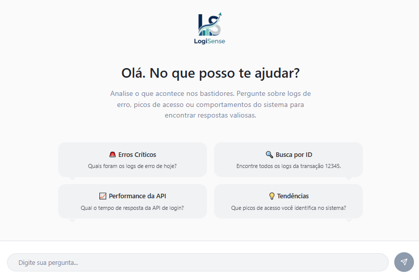
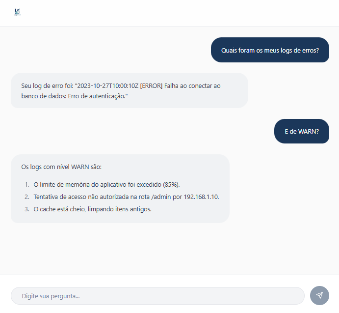

# Fluxo de Observabilidade e Chatbot RAG com Kestra, Vector, Kafka e Qdrant

Este projeto implementa uma solução completa de observabilidade e busca de logs, combinando um pipeline de ingestão de dados com uma aplicação de chatbot para perguntas e respostas. O fluxo de trabalho utiliza as tecnologias **Vector**, **Kafka**, **Kestra** e **Qdrant** para criar um sistema robusto de RAG (Retrieval-Augmented Generation) sobre dados de logs.

### Visão Geral do Fluxo de Dados

O fluxo de trabalho é projetado para ler logs de uma fonte contínua (`my_app_logs.log`), processá-los e, em seguida, torná-los pesquisáveis através de um chatbot de interface. O processo completo é o seguinte:

1.  **Ingestão de Dados (Vector):** O agente **Vector** monitora um arquivo de log local (`my_app_logs.log`), que atua como a fonte de dados primária. Cada nova linha de log adicionada ao arquivo é automaticamente lida e enviada para o tópico do Kafka.
2.  **Mensageria (Kafka):** O **Kafka** atua como um barramento de eventos, recebendo todos os logs enviados pelo Vector. Ele garante que os dados de log sejam persistentes e possam ser consumidos por múltiplos sistemas de forma assíncrona.
3.  **Orquestração e Processamento (Kestra):** A plataforma **Kestra** orquestra todo o processo de enriquecimento e ingestão de dados. Um *trigger* do Kestra monitora o tópico `app-logs` do Kafka. Assim que uma nova mensagem de log é detectada, o fluxo de trabalho é acionado.
    * **Passo 1: `create_chunks`**: Um script Python lê a mensagem de log do Kestra, formata-a como um *chunk* da LangChain e a prepara para a próxima etapa.
    * **Passo 2: `populate_qdrant`**: Um segundo script Python recebe o *chunk* preparado e utiliza os *embeddings* do Hugging Face para criar uma representação vetorial. Em seguida, ele armazena este vetor no **Qdrant**.
4.  **Banco de Dados Vetorial (Qdrant):** O **Qdrant** armazena todos os vetores de *embeddings*, agindo como a base de conhecimento vetorial do seu sistema. Ele é otimizado para realizar buscas de similaridade em alta velocidade.
5.  **Interface de Chat Customizada:** A aplicação de chat customizada atua como a interface do usuário. Ao receber uma pergunta, ela realiza as seguintes ações:
    * Converte a pergunta em um vetor de *embedding* (usando o mesmo modelo do Hugging Face).
    * Busca no Qdrant os *chunks* de log mais relevantes para a pergunta.
    * Utiliza um modelo de linguagem (LLM) para gerar uma resposta, combinando a pergunta original com os *chunks* de log encontrados.

### Diagrama do Fluxo de Trabalho (Mermaid)

```mermaid
graph TD
    subgraph Data-Ingestion
        A[my_app_logs.log] --> B(Vector);
    end

    subgraph Data-Processing
        B --> C{Kafka - app-logs};
        C --> D(Kestra Trigger);
    end

    subgraph Kestra-Workflow
        D --> E[create_chunks];
        E --> F[populate_qdrant];
    end

    subgraph Knowledge-Base
        F --> G(Qdrant);
    end

    subgraph Chatbot-Interface
        H[Usuário] --> I[Chat Customizado];
        I --> J{Modelos LangChain/Hugging Face};
        J --> G;
        G --> J;
        J --> I;
    end
````

-----

### Demonstração do Chatbot em Ação

A interface de usuário do chatbot foi desenvolvida com **React** e funciona como uma janela para a sua base de dados de logs.

#### 1\. Interface de Boas-Vindas

Ao iniciar o chat, a tela de boas-vindas é exibida, apresentando várias sugestões de conversas iniciais possíveis para guiar o usuário na exploração dos dados de logs.



-----

#### 2\. Chat em Ação

Aqui, você pode ver a interação com o chatbot. Ao fazer uma pergunta, a aplicação se comunica com o seu **backend** para buscar informações na **base de dados vetorizada do Qdrant** e gerar uma resposta relevante.



-----

### Tecnologias Utilizadas

  * **Vector**: Agente de coleta e processamento de logs.
  * **Kafka**: Plataforma de *streaming* de eventos.
  * **Kestra**: Orquestrador de *workflows* para o pipeline de dados.
  * **PostgreSQL**: Banco de dados utilizado pelo Kestra.
  * **Qdrant**: Banco de dados vetorial para armazenamento de *embeddings*.
  * **LangChain**: Framework para construir a aplicação de chatbot (RAG).
  * **Hugging Face**: Fornece o modelo de *embeddings* (`sentence-transformers/all-MiniLM-L6-v2`).
